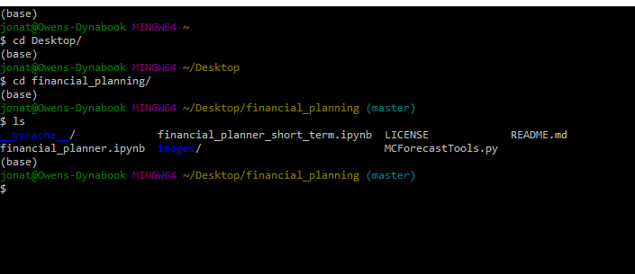
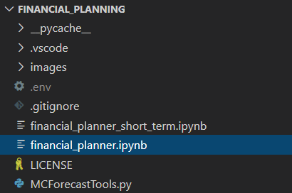

# Financial Planner
#### Assignment to show all the skills learned until now in the Rice University FinTech Bootcamp focusing on APIs![1]

---

## Table of contents
* [General info](#general-info)
* [Screenshots](#screenshots)
* [Technologies](#technologies)
* [Installation Guide](#installation-guide)
* [Code Examples](#code-examples)
* [Usage](#usage)
* [Sources](#sources)
* [Status](#status)
* [Contributors](#contributors)

---

## General Information
You have found it!  The following repository helps you visualize your personal savings!

- 1. Do you have enough money as an emergency fund composed of stocks and bonds?
- 2. What is your range of expected 30 year portfolio returns, distributed over stocks and bonds, for retirement?

These tools are amazing and can be dialed to increase or decrease your initial investment along with changing the weighted distribution of portfolio assets using the Jupyter Notebook file titled financial_planner.ipynb.  Enjoy!

### Wait!  There's more.

As a bonus, there is an additional Jupyter Notebook, financial_planner_short_term.ipynb, allowing you to make similar adjustments to your initial investment and weighted portfolio assets.  This tool gives a visual perspect on a 5 year and 10 year scale to help you maximize your returns on a shorter scale, hopefully for earlier retirement!

---

## Screenshots

* Savings health analysis
        
    

* Retirement planning
    

    

---

## Technologies

* Python - Version 3.7.7
* VS Code - Version 1.49.1
* Jupyter Notebook - Version 6.1.1
* Windows 10
* Library - pandas
* Library - dotenv
* Library - os
* Library - requests
* Library - alpaca_trade_api
* Library - MCForecastTools
* Library - matplotlib
* Monte Carlo Simulation

---

## Installation Guide

1. Download the entire repository titled, financial_planning.

2. Open Git Terminal
    
    

3. Navigate into the repository file path where the repository downloaded.

    

4. The files should be visible by typing the 'ls' command in the prompt and pressing the Enter key on your keyboard.  You will see the following files and the financial_planner.ipynb notebook for the 30 year simulation and the financial_planner_short_term.ipynb notebook for the five (5) and 10 year simulation.

    

5. The libraries in the [Technologies](#technologies) section of this README.md file are required to run the simulations.  Make sure each libary is installed by by running 'pip install package-name' where package-name is the name of each library shown.  The MCForecastTools.py file is provided for you in this repository and does not need to be installed.

6. Your own Alpaca API ID Key and Secret Key is needed to extract the stock and bond data from Alpaca.  Create a .env file, no name or characters before the period in .env, and place the file in the root directory of the financial_planning repository.  A convenient .gitignore file is already included in the repository, so the .env file does not upload to your own GitHub.com repository.  Add your keys to the .env file by copying the following template of code below, pasting the code in the .env file, and adding your keys between the single quotation marks.

```
APCA_API_KEY_ID = 'YOUR KEY HERE'
APCA_SECRET_KEY = 'YOUR SECRET KEY HERE'
```

*See [Usage](#usage) section below for instructions how to run the program.

---

## Code Examples

``` python
# Configuring a Monte Carlo simulation to forecast 30 years cumulative returns
MC_even_dist = MCSimulation(
    portfolio_data = df_stock_data,
    weights = [.4,.6],
    num_simulation = 500,
    num_trading_days = 252 * 30
)
```


---

## Usage

1. To run the analysis process, navigate to the directory where financial_planner.ipynb is located using Git Terminal within the financial_planning directory.

    

2. Execute the command 'code .' in the terminal to open VS Code.

    

3. VS Code opens.  Select the financial_planner.ipynb file or financial_planner_short_term.ipynb in the financial_planning directory depending on which simulation you want to run.

    

4. Click the Run All Cells button, double arrows, to run all cells in the Jupyter Notebook file.

    

5. All cells in the notbook run.  The simulations can take a few minutes to run, so please be patient while they process and display the data on the screen.


### * There are several variables that can be changed to customize your own portfolio assets, initial investment amount, and weights of each asset to run in the simulations.

### Portfolio Assets Quantity


### Portfolio Assets


### Initial Investment Amount


### Asset Weights


**Weights are represented in a decimal format percentage and should be in the same order as assigned for the portfolio assets ticker symbols.

---

## Sources

- [1] https://rice.bootcampcontent.com/Rice-Coding-Bootcamp/rice-hou-fin-pt-09-2020-u-c/tree/master/hw/05-APIs/Instructions

---

## Status

Project is: _finished_

---

## Contributors

* Jonathan Owens
* LinkedIn: www.linkedin.com/in/jonowens
