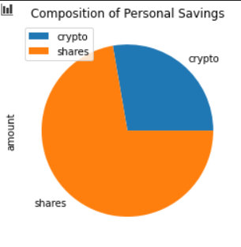

# Financial Planner
#### Assignment to show all the skills learned until now in the Rice University FinTech Bootcamp focusing on APIs![1]

---

## Table of contents
* [General info](#general-info)
* [Screenshots](#screenshots)
* [Technologies](#technologies)
* [Installation Guide](#installation-guide)
* [Code Examples](#code-examples)
* [Usage](#usage)
* [Sources](#sources)
* [Status](#status)
* [Contributors](#contributors)
* [License](#licence)

---

## General Information
You have found it!  The following repository helps you visualize your personal savings!

- 1. Do you have enough money as an emergency fund composed of stocks and bonds?
- 2. What is your range of expected 30 year portfolio returns, distributed over stocks and bonds, for retirement?

These tools are amazing and can be dialed to increase or decrease your initial investment along with changing the weighted distribution of portfolio assets using the Jupyter Notebook file titled financial_planner.ipynb.  Enjoy!

### Wait!  There's more.

As a bonus, there is an additional Jupyter Notebook, financial_planner_short_term.ipynb, allowing you to make similar adjustments to your initial investment and weighted portfolio assets.  This tool gives a visual perspect on a 5 year and 10 year scale to help you maximize your returns on a shorter scale, hopefully for earlier retirement!

---

## Screenshots

* Savings health analysis
        
    

* Retirement planning
    

    

---

## Technologies

* Python - Version 3.7.7
* VS Code - Version 1.49.1
* Jupyter Notebook - Version 6.1.1
* Windows 10
* Library - Pandas
* Library - Dotenv
* Library - OS
* Library - Requests
* Library - Alpaca Trade API
* Library - MCForecastTools
* Library - Matplotlib
* Monte Carlo Simulation

---

## Installation Guide

1. Download the entire repository titled, financial_planning.

2. Open Git Terminal
    
    
    
3. Navigate into repository file path where the repository downloaded.

    

4. The files should be visible and ready to run by typing the 'ls' command in the prompt and pressing the Enter key on your keyboard.  You should see the following files and the whale_analysis.ipynb notebook.

    

*See [Usage](#usage) section below for instructions how to run the program.

---

## Code Examples

---

## Usage

1. To run the analysis process, navigate to the directory where whale_analysis.ipynb is located using Git Terminal within the a_whale_off_the_portfolio directory.

    

2. Execute the command 'code .' in the terminal to open VS Code.

    

3. VS Code opens.  Select the main.ipynb file in the PyBank directory.

    

4. Click the Run All Cells button, double arrows, to run all cells in the Jupyter Notebook file.

    

5. All cells in the notbook run.

---

## Sources

- [1] https://rice.bootcampcontent.com/Rice-Coding-Bootcamp/rice-hou-fin-pt-09-2020-u-c/tree/master/hw/05-APIs/Instructions

---

## Status

Project is: _in progress_

---

## Contributors

* Jonathan Owens
* LinkedIn: www.linkedin.com/in/jonathan-owens-b7951219
